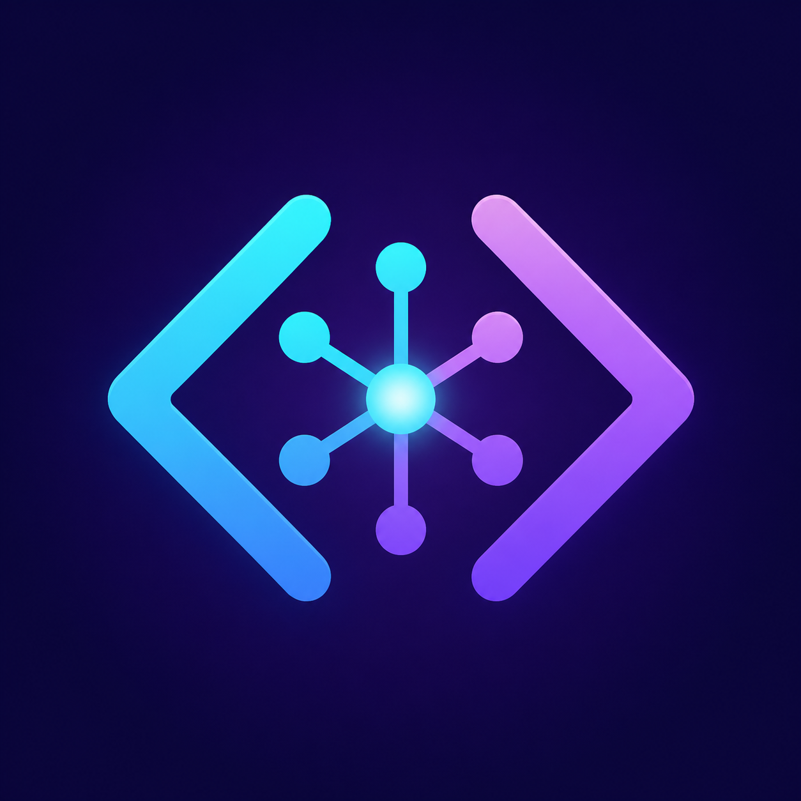
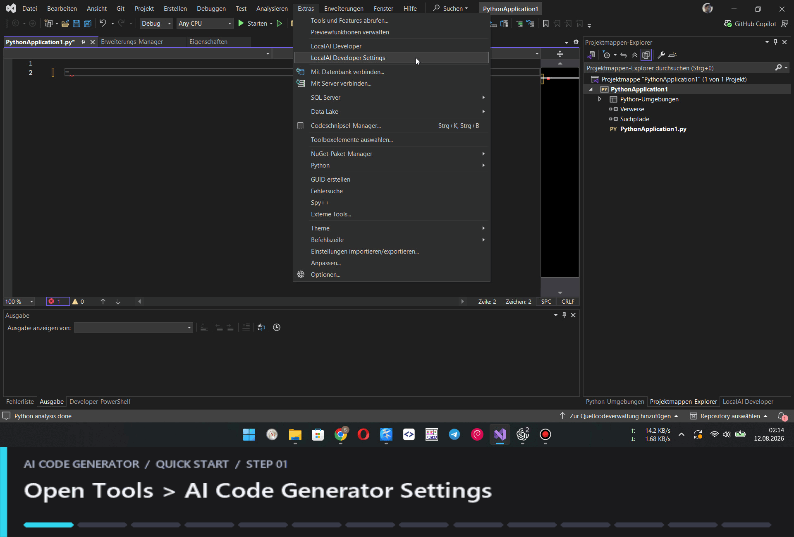

# AI Code Generator for Visual Studio 2022



[](LICENSE.txt)
[](https://marketplace.visualstudio.com/)

Use AI to generate plans and patches for your entire project, simply via a prompt. AI Code Generator is a Visual Studio 2022 extension for AI-assisted software development with local or remote language models. It turns a development goal into a reviewable plan, generates one patch at a time, validates C# with Roslyn, builds the solution once at the end of the workflow, and can request bounded repair patches when compilation fails.

The extension supports English and German and follows the active Visual Studio color theme.



## Features

- Structured development plans with step and plan status
- Side-by-side review workflow with unified, colorized diffs
- Manual approval, skip, cancel, and rollback actions
- Atomic transaction history, including rollback of completed workflows
- Roslyn syntax validation before patch approval
- Language-aware context resolution and preflight validation for C#, Python, PHP,
  JavaScript, TypeScript, JSON, XML/XAML, HTML, and CSS
- Deferred solution compilation after the final relevant step
- Bounded automatic repair and recompilation
- Persistent developer sessions and structured history
- Token and character budget estimates per provider/model profile
- Optional Git branch, commit, push, and GitHub pull-request workflow
- Automatic workspace selection from the open Visual Studio solution
- English and German UI
- Dark, Light, and Blue Visual Studio theme support

## Providers

- LM Studio (OpenAI-compatible API)
- Ollama (native API)
- Mistral
- OpenAI

The provider interface is intentionally transport-agnostic. Custom OpenAI-compatible endpoints can be added directly under **Tools > AI Code Generator Settings** without changing the workflow coordinators.

## Architecture

```text
Visual Studio 2022 VSIX (.NET Framework 4.7.2 / WPF)
        |
        | JSON-RPC over stdin/stdout
        v
AI Code Generator Backend (.NET 8)
        |
        +-- Planning and plan validation
        +-- Patch preparation and approval policy
        +-- Transactional apply and rollback
        +-- Roslyn syntax/build validation
        +-- Repair coordination
        +-- Session and history persistence
        +-- Optional Git/GitHub workflow
```

The Visual Studio extension is a UI host. Workflow state and filesystem mutations live in the backend so approval, execution, compilation, repair, and persistence remain separated.

## Language analysis

The context resolver starts with each plan step's explicit targets, adds nearby
project manifests, and builds a transitive dependency graph before applying
heuristic ranking. It follows Python imports, Composer PSR-4 and PHP includes,
JavaScript/TypeScript imports and path aliases, C# namespaces and referenced
types, MSBuild project items, XAML code-behind links, HTML assets, and CSS
imports. Context selection remains bounded by the active provider's file and
token budgets. Dependencies that do not fit are listed explicitly in the
request as omitted, so the model can request a narrower follow-up step.

- C#: Roslyn syntax and declaration context, followed by the selected solution or project build
- Python: fixed `python -m py_compile` validation when Python is installed
- PHP: fixed `php -l` validation when PHP is installed
- JavaScript: fixed `node --check` validation when Node.js is installed
- TypeScript: fixed `tsc --noEmit` validation when TypeScript is installed
- JSON/JSONC: `System.Text.Json`
- XML, XAML, project files, props, targets, config, and RESX: `System.Xml.Linq`
- HTML and CSS-family files: deterministic structural validation

External validation commands are selected by registered backends. Model output
can never provide an executable or arbitrary command-line arguments.
If an optional interpreter cannot start or does not finish its syntax check
within the validator timeout, AI Code Generator falls back to deterministic
structural validation. An internal validator timeout is not treated as a user
cancellation and cannot mark an unapplied patch as retained.
Windows App Execution Alias messages such as "Python was not found" are treated
as unavailable validator infrastructure, never as source-code syntax errors.

## Repository Layout

```text
src/
  LocalAI.Developer.VisualStudio/   Visual Studio 2022 VSIX and WPF UI
  LocalAI.Developer.Backend/        .NET 8 workflow backend
tests/
  LocalAI.Developer.Backend.Tests/  End-to-end and component tests
AI.Code.Generator.sln
```

## Requirements

- Visual Studio 2022 17.x
- Visual Studio extension development workload
- .NET 8 SDK/runtime
- A supported LLM endpoint
- Git (optional)
- GitHub CLI `gh` (optional, only for pull-request creation)

## Build

1. Clone the repository.
2. Open `AI.Code.Generator.sln` in Visual Studio 2022.
3. Build `LocalAI.Developer.VisualStudio` in Debug or Release.

The VSIX build publishes the .NET 8 backend and embeds it under `Backend/` inside the extension package.

Command-line build:

```powershell
& "C:\Program Files\Microsoft Visual Studio\2022\Community\MSBuild\Current\Bin\MSBuild.exe" `
  .\src\LocalAI.Developer.VisualStudio\LocalAI.Developer.VisualStudio.csproj `
  /t:Rebuild /p:Configuration=Release
```

## Test

```powershell
dotnet run --project .\tests\LocalAI.Developer.Backend.Tests\LocalAI.Developer.Backend.Tests.csproj -c Release
```

## Run in the Experimental Instance

1. Set `LocalAI.Developer.VisualStudio` as the startup project.
2. Press `F5`.
3. Open a solution in the Visual Studio Experimental Instance.
4. Choose **Tools > AI Code Generator**.

## Install

Build the VSIX, close all Visual Studio instances, and open:

```text
src/LocalAI.Developer.VisualStudio/bin/Release/LocalAI.Developer.VisualStudio.vsix
```

Restart Visual Studio and open **Tools > AI Code Generator**.

Marketplace publication metadata is included in [vs-publish.json](vs-publish.json). The first upload is configured as a private listing so it can be verified before public release; see [MARKETPLACE.md](MARKETPLACE.md).

## Configuration

Open **Tools > AI Code Generator Settings** to configure provider URLs, models, API keys, language, approval mode, timeouts, and Git policy. Use **Load models** beside the editable model dropdown to discover models from the selected provider. The same dialog lets you add, rename, and remove custom providers. API keys are protected with Windows DPAPI for the current user.

The main **AI Code Generator** window deliberately exposes only the active provider selector. Selecting another provider stores it as the active profile; connection details remain centralized in the settings dialog.

Environment variables:

- `LOCALAI_LMSTUDIO_API_KEY`
- `LOCALAI_MISTRAL_API_KEY`
- `LOCALAI_OPENAI_API_KEY`
- `LOCALAI_API_KEY`
- `LOCALAI_WORKSPACE` (fallback only when no solution is open)

## Safety Model

- Generated paths must remain inside the selected workspace.
- Patches are validated before approval and application.
- Risk-based approval can require explicit review for every patch.
- Compilation failures retain applied files for inspection until the user requests rollback.
- Git push and pull-request creation are always separate user actions.
- Repair attempts and patch regeneration attempts are bounded.

## Localization

English and German are included. Select the language under **Tools > AI Code Generator Settings**. Compiler output and provider error payloads remain unchanged so diagnostic text is not corrupted by translation.

## Contributing

See [CONTRIBUTING.md](CONTRIBUTING.md) for the development workflow and pull-request checklist.

Security and privacy concerns can be reported through the [GitHub issue tracker](https://github.com/Mastaaa1987/ai-code-generator-visualstudio/issues). See [PRIVACY.md](PRIVACY.md) for details about project context, provider requests, credentials, and local session storage.

## License

AI Code Generator is licensed under the [MIT License](LICENSE.txt).
Third-party components retain their respective licenses; see
[THIRD-PARTY-NOTICES.md](THIRD-PARTY-NOTICES.md).
